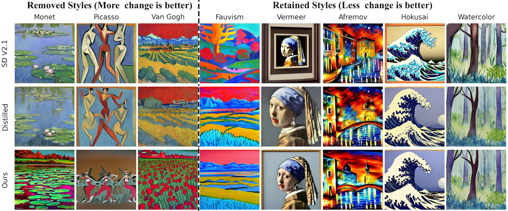
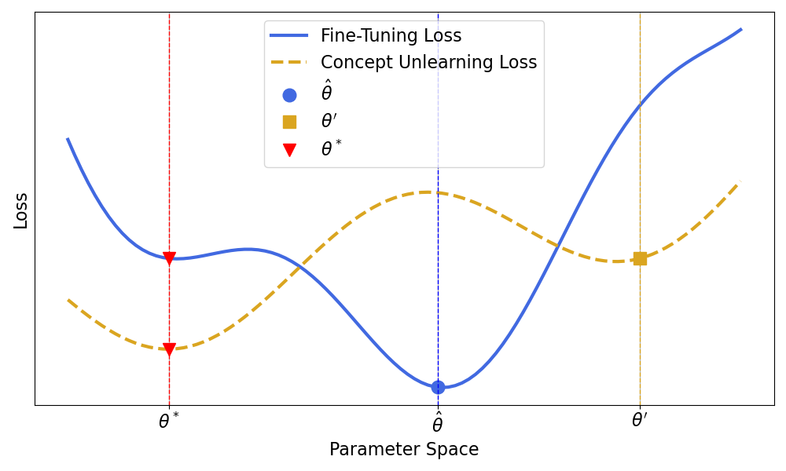

# Efficient Fine-Tuning and Concept Suppression for Pruned Diffusion Models

[](https://arxiv.org/abs/2412.15341) 


The implementation of the
paper ["Efficient Fine-Tuning and Concept Suppression for Pruned Diffusion Models"](https://arxiv.org/abs/2412.15341)

<p align="center">
  
</p>
<p align="left">
  <em>Comparison of generative quality and style adherence: Row 1: The original Stable Diffusion 2.1 model. Row 2: A pruned version
  fine-tuned with 20,000 iterations of combined DDPM and distillation loss. Row 3: A pruned version fine-tuned with 20,000 iterations of
  our proposed bilevel fine-tuning approach, removing styles of Van Gogh, Monet, and Picasso. Our bilevel method is successful in retaining
  generative quality and style diversity while suppressing undesirable concepts.</em>
</p>

<p align="center">
  
</p>
<p align="left">
<em>
Why can a two-stage approach (fine-tuning followed by forgetting) be suboptimal? If fine-tuning yields $\hat{\theta}$, initializing the concept unlearning parameters with $\hat{\theta}$ and optimizing the concept unlearning loss results in $\theta^{'}$, which is suboptimal for both fine-tuning and for concept unlearning. In contrast, our bilevel method produces the optimal solution $\theta^{*}$, achieving better performance for both fine-tuning and unlearning.
</em>
</p>

## Table of Contents

1. [Installation](#installation)
2. [Data Preparation](#data-preparation)
   - [Download MS-COCO 2017](#1-download-ms-coco-2017)
3. [Training](#training)
   - [Pruning](#1-pruning)
   - [Data Preparation for Fine-tuning](#2-data-preparation-for-fine-tuning)
   - [Fine-tuning](#3-fine-tuning)
4. [Image Generation](#image-generation)
5. [Evaluation](#evaluation)
   - [FID Score](#1-fid-score)
   - [CLIP Score](#2-clip-score)
   - [CMMD](#3-cmmd)
6. [Baselines](#baselines)
7. [License](#license)
8. [Citation](#citation)

## Installation

Follow these steps to set up the project:

### 1. Create Conda Environment

Use the provided [env.yaml](env.yaml) file:

```bash
conda env create -f env.yaml
```

### 2. Activate the Conda Environment

Activate the environment:

```bash
conda activate unlearn-ft
```

### 3. Install Project Dependencies

From the project root directory, install the dependencies:

```bash
pip install -e .
```

## Data Preparation

Prepare the data for training as mentioned in the paper. You can also adapt our method for your own dataset with minor code modifications.


### 1. Download MS-COCO 2017

#### 1.1 Download the training and validation images

Download [2017 train](http://images.cocodataset.org/zips/train2017.zip)
and [2017 val](http://images.cocodataset.org/zips/val2017.zip) images from
the [COCO website](http://cocodataset.org/#download). Place them in your chosen directory.

#### 1.2 Download the annotations

Download the [2017 train/val annotations](http://images.cocodataset.org/annotations/annotations_trainval2017.zip)
and place them in the same directory as the images. Your directory should look like this:

```
coco
├── annotations
│   ├── captions_train2017.json
│   ├── captions_val2017.json
│   └── ...
└── images
    ├── train2017
    │   ├── COCO_train2017_000000000009.jpg
    │   └── ...
    └── val2017
        ├── COCO_val2017_000000000042.jpg
        └── ...
```

## Training


## Evaluation
To evaluate Unlearn-FT, we report the FID, CLIP Score.

### 1. FID Score
We use [clean-fid](https://github.com/GaParmar/clean-fid) to calculate the FID score. The numbers reported in the paper are calculated using this pytorch legacy mode.


#### 1.1 MS-COCO Preparation
We sample use the validation images from the 2017 MS-COCO. Check out the [sample and resize script](scripts/metrics/resize_and_save_images.py).

#### 1.2 Generate Custom Statistics

Generate custom statistics for both sets of reference images::
```bash
from cleanfid import fid
fid.make_custom_stats(dataset, dataset_path, mode="legacy_pytorch") # mode can be clean too.
```

Now we can calculate the FID score for the generate images using [the provided script](scripts/metrics/fid.py).

### 2. CLIP Score
To calculate clip score, we use [this library](https://github.com/Taited/clip-score). Extract features of reference images with the [clip feature extraction script](scripts/metrics/clip_features.py) and calculate the score using the [clip score script](scripts/metrics/clip_score.py).


## Baselines
The scripts to run the baselines are in [this directory](scripts/baselines).


## License

This project is licensed under the MIT License - see the [LICENSE](LICENSE) file for details.

## Citation
If you find this work useful, please consider citing the following paper:

```bibtex
@inproceedings{shirkavand2025efficient,
  title={Efficient fine-tuning and concept suppression for pruned diffusion models},
  author={Shirkavand, Reza and Yu, Peiran and Gao, Shangqian and Somepalli, Gowthami and Goldstein, Tom and Huang, Heng},
  booktitle={Proceedings of the Computer Vision and Pattern Recognition Conference},
  pages={18619--18629},
  year={2025}
}
```
